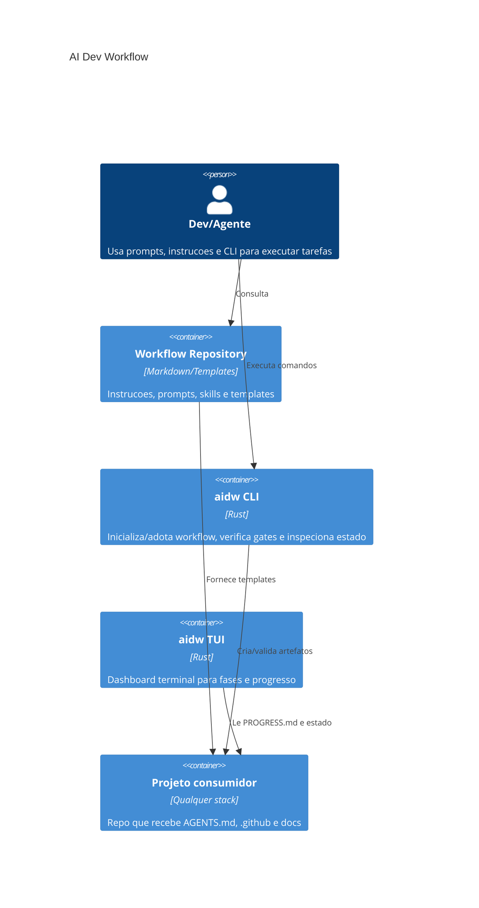

# Architecture Overview - AI Dev Workflow

## Visao Geral
AI Dev Workflow e um toolkit stack-agnostico para orientar agentes de IA em desenvolvimento de software com contexto, decisoes, qualidade e rastreabilidade.

## Containers

## Modulos Principais
- `.github/instructions/`: regras universais e por stack para agentes.
- `.github/prompts/`: prompts reutilizaveis para fluxos como feature, bug, ADR e review.
- `skills/`: skills agnosticas de agente, com `atlas` como orquestradora principal.
- `templates/`: docs e arquivos base copiados para projetos consumidores.
- `crates/aidw-core`: logica compartilhada de config, deteccao de stack, templates, progresso e workflow.
- `crates/aidw-cli`: comandos de terminal.
- `crates/aidw-tui`: interface terminal interativa.
- `specs/`: especificacoes vivas para mudancas do proprio projeto.

## Fluxo de Dados
1. O usuario instala/adota o workflow em um projeto.
2. Templates e instrucoes sao copiados para o projeto consumidor.
3. O agente le `AGENTS.md`, `PROGRESS.md`, backlog, ADRs e specs.
4. O agente executa a mudanca seguindo Context -> Design -> Plan -> Execute -> Verify -> Document -> Handoff.
5. `aidw verify` roda gates configurados em `.aidw.toml`.

## Limites
- O repositorio nao hospeda aplicacao web nem servico persistente.
- A CLI nao deve depender de modelo LLM para executar comandos basicos.
- Evals de agentes sao complementares aos testes deterministas, nao substitutos.
