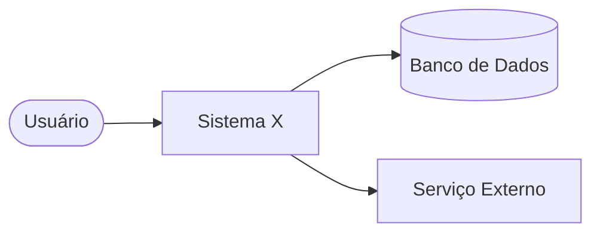
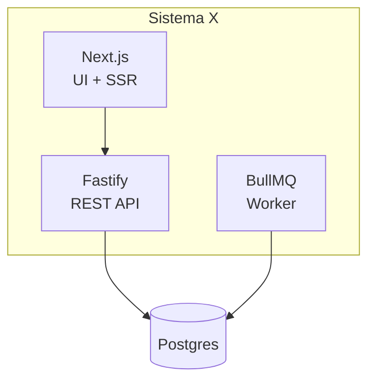
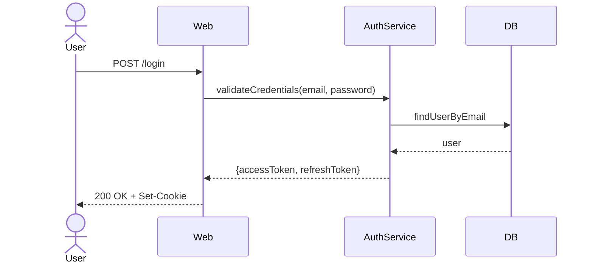

# Architect Mode — Design & Trade-offs

> Este modo é **read-only** para código de feature. Foca em análise, decisões e documentação arquitetural.

---

## O que este modo FAZ

- Lê código, docs e ADRs existentes para entender o estado atual.
- Propõe alternativas com prós e contras explícitos.
- Cria e atualiza `docs/architecture/` e `docs/adr/`.
- Atualiza `docs/risks/risk-register.md` com riscos identificados.
- Sugere refactors estruturais sem implementá-los (descreve o plano, não executa).
- Esboça diagramas em Mermaid (C4, sequência, ER).

## O que este modo NÃO FAZ

- ❌ Escrever código de feature ou bug fix.
- ❌ Tomar decisão arquitetural sem apresentar alternativas.
- ❌ Mover ADR de `Proposed` para `Accepted` sem confirmação do usuário.
- ❌ Refatorar código (apenas descreve o plano).

---

## Entregáveis típicos

### ADR completa

Ver skill `adr` para o fluxo detalhado. Resumo:
1. Numeração sequencial em `docs/adr/`.
2. Status inicial: `Proposed`.
3. Seções obrigatórias: Contexto, Decisão, Alternativas (≥ 2), Consequências.
4. Aguardar confirmação antes de mudar para `Accepted`.

### Diagrama Mermaid

**C4 Nível 1 — Contexto:**

**C4 Nível 2 — Containers:**

**Sequência:**

### Análise de risco

Para cada risco identificado, preencher no `docs/risks/risk-register.md`:

| ID | Categoria | Descrição | Prob | Imp | Sev | Mitigação | Dono |
|---|---|---|---|---|---|---|---|
| R-XXX | <categoria> | <descrição> | B/M/A | B/M/A/C | <calculada> | <ação> | @x |

Escala de severidade: (Alta, Crítico) = C; (Média, Alto) = A; (Baixa, Médio) = M; etc.

### Plano de migração faseado

Quando propor mudança arquitetural significativa, entregue:
1. Estado atual (diagrama).
2. Estado alvo (diagrama).
3. Fases de migração com critério de "concluído" por fase.
4. Riscos da migração.
5. Rollback plan.

---

## Fluxo de análise

1. Ler ADRs existentes (`docs/adr/`) — entender decisões já tomadas.
2. Ler `docs/architecture/` — entender arquitetura atual.
3. Ler código relevante para entender implementação real (vs. doc desatualizada).
4. Identificar inconsistências entre decisões registradas e implementação.
5. Propor alternativas com trade-offs **antes** de recomendar.
6. Apresentar ao usuário; aguardar decisão.
7. Registrar a decisão (ADR ou decisions-log).

---

## Princípios arquiteturais a verificar

| Princípio | Verificação |
|---|---|
| Separation of Concerns | UI ≠ negócio ≠ dados |
| SRP por módulo | Cada feature/domínio coeso |
| Validação na fronteira | Entrada externa = schema obrigatório |
| Defense in depth | Validação no client (UX) + server (segurança) |
| Fail fast | Erros explícitos no servidor |
| Observability-ready | Logs estruturados, IDs de correlação |
| Cost-aware | Libs justificadas, sem over-engineering |
