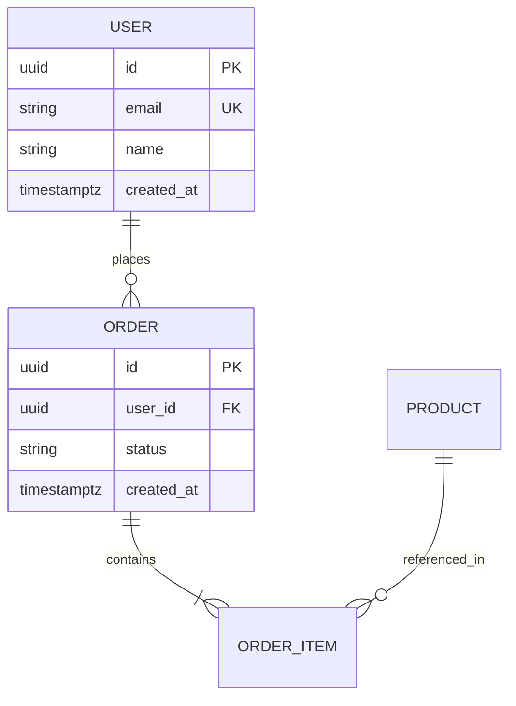

# Modelo de Dados — {{PROJECT_NAME}}

> Esquema lógico das entidades principais. Atualize a cada migration.

## Diagrama ER

## Entidades

### `users`

| Campo       | Tipo        | Constraints              | Notas |
| ----------- | ----------- | ------------------------ | ----- |
| `id`        | uuid        | PK, default gen_random   |       |
| `email`     | text        | UK, NOT NULL             |       |
| `created_at`| timestamptz | NOT NULL, default now()  |       |

<!-- Repita por entidade. -->

## Convenções

- IDs: `uuid` (não auto-increment) para evitar enumeração.
- Timestamps: `timestamptz` (UTC), nunca `timestamp` sem TZ.
- Soft delete: campo `deleted_at` (nullable) — quando aplicável.
- Auditoria: `created_at`, `updated_at` em toda tabela.
- Naming: `snake_case` (alinhado a Postgres); FKs como `<entidade>_id`.

## Migrations

- Ferramenta: `<Drizzle | Prisma | Alembic | Django>`.
- Pasta: `<caminho>`.
- Política: nunca editar migration aplicada — crie nova.
