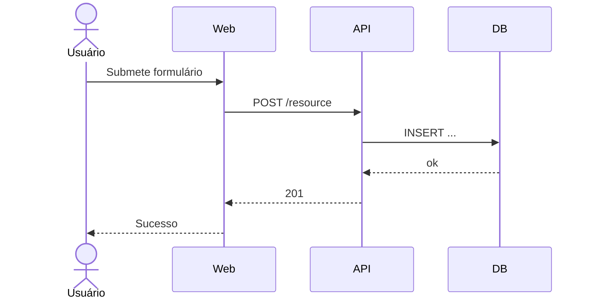

# Arquitetura — Visão Geral

> Modelo C4 nível 1 (contexto) e nível 2 (containers). Mantenha curto e visual.

## Contexto (Nível 1)

<!--
  Quem usa, com quais sistemas externos integramos.
  Use Mermaid:
-->

```mermaid
%% Exemplo — adapte ao seu projeto
flowchart LR
    user([Usuário]) --> app[Aplicação {{PROJECT_NAME}}]
    app --> db[(Banco de Dados)]
    app --> ext[Serviço Externo X]
```

## Containers (Nível 2)

<!--
  Quais "containers" (apps, serviços, DBs) compõem o sistema, com tecnologia e responsabilidade.
-->

| Container         | Tech            | Responsabilidade                          |
| ----------------- | --------------- | ----------------------------------------- |
| `web`             | Next.js         | UI + SSR + Server Actions                 |
| `api`             | Fastify         | API REST para integrações externas        |
| `db`              | Postgres        | Persistência                              |
| `worker`          | Node + BullMQ   | Jobs assíncronos (e-mail, processamento)  |

## Fluxos críticos

<!--
  Descreva 1-3 fluxos críticos com diagrama de sequência (Mermaid).
-->



## Decisões de fundo

- Ver [`tech-stack.md`](tech-stack.md) e ADRs em [`../adr/`](../adr/).
